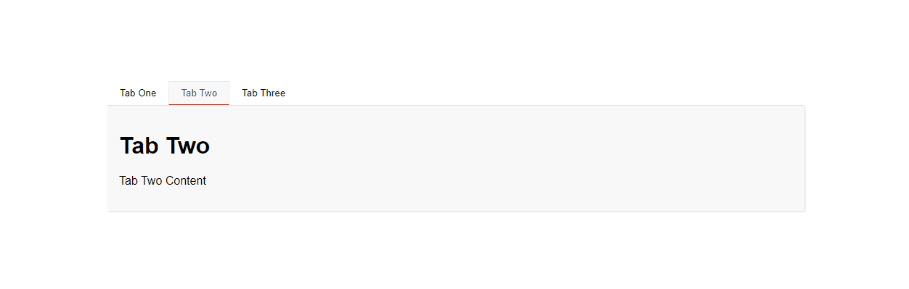

# React Simple Tabs Component

> A simple react component for adding accessible easy-to-use Tabs to your project.

[](https://www.npmjs.com/package/react-simple-tabs-component)


<p align="center">
  
</p>

## Install

```bash
# npm
npm i react-simple-tabs-component

# Yarn
yarn add react-simple-tabs-component
```

## Usage

```jsx
import { Tabs } from 'react-simple-tabs-component'
// (Optional) if you don't want to include bootstrap css stylesheet
import 'react-simple-tabs-component/dist/index.css'

// Component Example
const TabOne = () => {
  return (
    <>
      <h3>Tab One</h3>
      <p>
        Lorem ipsum dolor sit amet, consectetur adipisicing elit. Perferendis sint illum iusto nostrum cumque qui
        voluptas tenetur inventore ut quis?
      </p>
    </>
  )
}

// Tabs structure Array
const tabs = [
  {
    label: 'Tab One', // Tab Title - String
    Component: TabOne // Tab Body - JSX.Element
  },
  {
    label: 'Tab Two',
    Component: TabTwo
  },
  {
    label: 'Tab Three',
    Component: TabThree
  }
]

export default function App() {
  return (
    <div className='App'>

      <Tabs tabs={tabs} /* Props */ />
    </div>
  )
```

### Available Props

| Prop          | Type             | Options  | Description                               |          Default           |
| ------------- | ---------------- | -------- | ----------------------------------------- | :------------------------: |
| `tabs`        | Array of objects | Required | Array of objects for your Tabs            |            `-`             |
| `orientation` | String           | Optional | Tab orientation `horizontal` - `vertical` |        `horizontal`        |
| `type`        | String           | Optional | Tabs type `tabs` - `pills`                |           `tabs`           |
| `className`   | String           | Optional | A className applied to the main `div`     | `bootstrap-tabs-component` |

---

## Style

The Component is based on Bootstrap 5 `HTML` structure and `CSS` classes so it will work out of the box if Bootstrap 5 css stylesheet is already included in you project. If you don't have/want to include Bootstrap, you still can use a `standalone` css stylesheet which was extracted form bootstrap 5 stylesheet. Just add it:

```jsx
import 'react-simple-tabs-component/dist/index.css'
```

<br />

[](https://codesandbox.io/s/react-typescript-tabs-forked-0txii?fontsize=14&hidenavigation=1&theme=dark)

### License

MIT © [awran5](https://github.com/awran5/)
