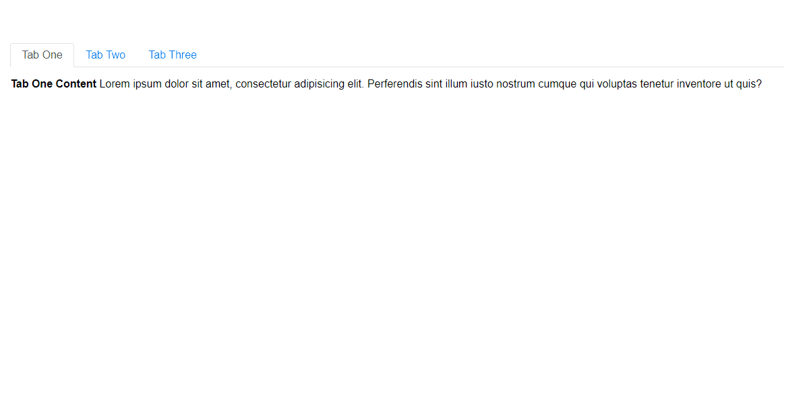

# React Simple Tabs Component

> A simple react component for adding accessible easy-to-use Tabs to your project.

[](https://www.npmjs.com/package/react-simple-tabs-component)


<p align="center">
  
</p>

## Install

```bash
# npm
npm i react-simple-tabs-component

# Yarn
yarn add react-simple-tabs-component
```

## Usage

```jsx
import React, { useState } from 'react'
import { Tabs } from 'react-simple-tabs-component'
// (Optional) Provide some basic style
import 'react-simple-tabs-component/dist/index.css'

// Tabs structure Array
const tabs = [
  {
    label: 'Tab One', // Tab title
    index: 1,         // Tab index
    Component: TabOne // Tab Component
  },
  {
    label: 'Tab Two',
    index: 2,
    Component: TabTwo
  },
  {
    label: 'Tab Three',
    index: 3,
    Component: TabThree
  }
]

export default function App() {
  const [selectedTab, setSelectedTab] = useState(tabs[0].index)
  return (
    <div className='App'>

      <Tabs tabs={tabs} onClick={setSelectedTab} selectedTab={selectedTab} />
    </div>
  )
```

### Available Props

| Prop          | Type             | Options  | Description                               |     Default      |
| ------------- | ---------------- | -------- | ----------------------------------------- | :--------------: |
| `tabs`        | Array of objects | Required | Array of objects for your Tabs            |       `-`        |
| `selectedTab` | Integer          | Required | A stateful value holding the current Tab  |       `0`        |
| `onClick`     | Function         | Required | Function to update the current Tab        |       `-`        |
| `orientation` | String           | Optional | Tab orientation `horizontal` - `vertical` |   `horizontal`   |
| `className`   | String           | Optional | A className for custom styles             | `tabs-component` |

### [sandbox](https://codesandbox.io/s/react-typescript-tabs-js8xi)

### License

MIT © [awran5](https://github.com/awran5/)
